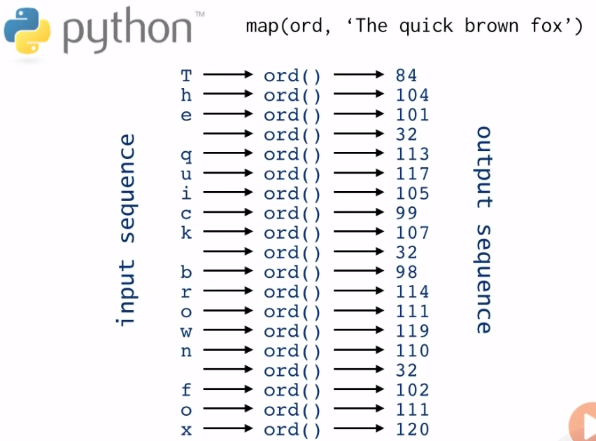
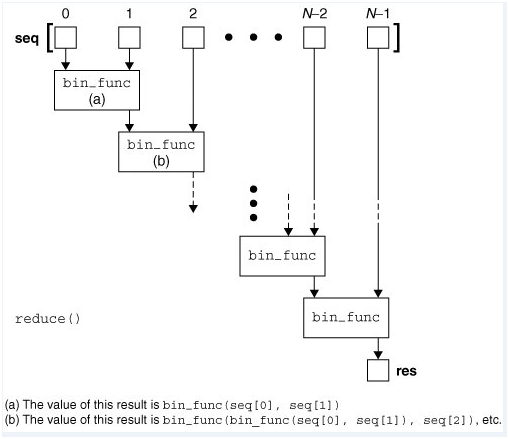

# iterables and iteration
## multi-input comprehensions
what is the comprehensions?
short-hand syntax for creating collections and iterablem and comprehensions can use multiple input sequences and multiple if-clauses, for instance:
```python
x = [(x,y) for x in range(5) for y in range(3)]
>>> [(x,y) for x in range(5) for y in range(3)]
[(0, 0), (0, 1), (0, 2), (1, 0), (1, 1), (1, 2), (2, 0), (2, 1), (2, 2), (3, 0), (3, 1), (3, 2), (4, 0), (4, 1), (4, 2)]
#the "for x in range(5)" is the earlier for-clause, and the y is the later ffor_clause
#this is more like this:
points = []
for x in range(5):
    for y in range(3);
        points.append((x,y))

>>>points...
```
## comprehensions can be nested inside other comprehensions
for example:
```python
vals = [[y*3 for y in range(x)] for x in range(10)]

#this is more like
outer = []
for x in range(10):
    inner = []
    for y in range(x):
        inner.append(y*3)
    outer.append(inner)
#here is the result:
>>> vals
[[], [0], [0, 3], [0, 3, 6], [0, 3, 6, 9], [0, 3, 6, 9, 12], [0, 3, 6, 9, 12, 15], [0, 3, 6, 9, 12, 15, 18], 
[0, 3, 6, 9, 12, 15, 18, 21], [0, 3, 6, 9, 12, 15, 18, 21, 24]]
```
this is equal to all kind of comprehensions, dict comprehensions, and  generator cpomprehensions, for example:
```python
g = ((x,y) for x in range(10) for y in range(x))
>>> type(g)
<class 'generator'>
>>> print(g)
<generator object <genexpr> at 0x03248F30>
>>> list(g) 
[(1, 0), (2, 0), (2, 1), (3, 0), (3, 1), (3, 2), (4, 0), (4, 1), (4, 2), (4, 3), (5, 0), (5, 1), (5, 2), (5, 
3), (5, 4), (6, 0), (6, 1), (6, 2), (6, 3), (6, 4), (6, 5), (7, 0), (7, 1), (7, 2), (7, 3), (7, 4), (7, 5), (7, 6), (8, 0), (8, 1), (8, 2), (8, 3), (8, 4), (8, 5), (8, 6), (8, 7), (9, 0), (9, 1), (9, 2), (9, 3), (9, 4), (9, 5), (9, 6), (9, 7), (9, 8)]
# genertor use "()" instead of "[]"
```
## the map() function

the map function apply a function to every element in a sequence, producing a new sequence. for example:

the result would like this:

the map function is lazy, and only run ionce per calling time. for example:
```python
>>> map(ord, 'hello world')
<map object at 0x033B0B10>
>>> x = map(ord, 'hello world') 
>>> next(x) 
104
>>> next(x)
101
>>> next(x)
```
you could also use the list or for loop to call everything at one time:
```python
>>> list(map(ord, 'hello world'))
[104, 101, 108, 108, 111, 32, 119, 111, 114, 108, 100]
```
### map() can accept any number of input sequences

the number of input sequences must **match** the number of function arguments


for example:
```python
size = ["small", "medium'", 'large']
colors = ['lavendar', 'teal', 'burnt orange']
animals = ['koala', 'platypus', 'salamander']
def combine(size, color, animal):
    return '{} {} {}'.format(size, color, animal)

>>>list(map(combine, size, colors, animals))
['small lavendar koala', "medium' teal platypus", 'large burnt orange salamander']
```
 ## the filter() function
 apply a function to each element in a sequence, constructing a new sequence with the elemetns for which the functions returns True
 for example:
  
  ```python
positives = filter(lambda x:x>0, [1,-5, 0,6,-2,8])
>>> positives
<filter object at 0x033B0CB0>
>>> list(positives) 
[1, 6, 8]
# the filter funciton is as lazy as mapping
```
passing None as the first argument to filter() will remove elements which evaluate to False.
```python
positives = filter(None, [1,-5, 0,6,-2,8, False])
>>> list(positives)
[1, -5, 6, -2, 8]
```
## the functools..reduce() function
repeatedly apply a function to the elements of a sequence, reducing them to a single value

Python函数式编程之reduce()
reduce() 
格式： 
reduce (func, seq[, init()]) 
reduce()函数即为化简函数，它的执行过程为：每一次迭代，都将上一次的迭代结果（注：第一次为init元素，如果没有指定init则为seq的第一个元素）与下一个元素一同传入二元func函数中去执行。在reduce()函数中，init是可选的，如果指定，则作为第一次迭代的第一个元素使用，如果没有指定，就取seq中的第一个元素。 
reduce()函数的执行过程如下图所示： 

 
从reduce函数的执行过程，让我们很容易联想到求一个数的阶乘，而Python中并没有给出一个求阶乘的内置函数，正好我们就拿这个例子来说明reduce函数吧。
```python
#未指定init的情况
>>> n = 6
>>> print reduce(lambda x, y: x * y, range(1, n))
120
1
2
3
4
```
上面的例子中range(1,6)函数生成的是一个[1, 2, 3, 4, 5]这样的列表，这里我们给它个名叫seq1吧，reduce()函数执行时，由于没有指定init参数，所以将取seq1中的第一个元素1，作为第一个元素，由于前面的lambda有2个变量，所以需要两个实参，于是就取seq1中的第2个元素2，与第一个元素1一起传入lambda中去执行，并将返回结果2，并同下一个元素3再一起传入lambda中执行，再次返回的结果，作为下一次执行的第一个元素，依次类推，就得出结果5! = 120。 
如果我们希望得到阶乘的结果再多增加几倍，可以启用init这个可选项。如：
```python
>>> print reduce(lambda x, y: x * y, range(1, n),2)
240
1
2
```
这个时候，就会将init作为第一个元素，和seq1中的第一个元素1一起传入lambda函数中去执行，返回结果再作为下一次的第一个元素。

## combine the map() and the reduce()

直接上代码：
```python
def count_words(doc):
    normalised_doc = ''.join(c.lower() if c.isalpha() else ' ' for c in doc)
    frequencies = {}
    for word in normalised_doc.split():
        frequencies[word] = frequencies.get(word, 0)  + 1
    return frequencies
#let try this:
>>>count_words('it was the best of time,s it was the worst of times.')
{'it': 2, 'was': 2, 'the': 2, 'best': 1, 'of': 2, 'time': 1, 's': 1, 'worst': 1, 'times': 1}
```
补充一下dictionary.get 的用法：
dict.get(key, default=None)
参数
key -- 字典中要查找的键。
default -- 如果指定键的值不存在时，返回该默认值值。

if the document in list:
```python
document = [
    'this is the most beautiful day',
    'I love such a beautiful day',
    'this is a great day',
    'I love this great day',
]
counts = map(count_words, document)
>>> counts
<map object at 0x033C6BB0>
>>> list(counts) 
[{'this': 1, 'is': 1, 'the': 1, 'most': 1, 'beautiful': 1, 'day': 1}, {'i': 1, 'love': 1, 'such': 1, 'a': 1, 
'beautiful': 1, 'day': 1}, {'this': 1, 'is': 1, 'a': 1, 'great': 1, 'day': 1}, {'i': 1, 'love': 1, 'this': 1, 'great': 1, 'day': 1}]

#if you want to combine the result into one list
def combine_counts(d1, d2):
    d = d1.copy()
    for word, count in d2.items():
        d[word] = d.get(word, 0) + count
    return d

total_counts = reduce(combine_counts, counts)
>>> total_counts
{'this': 3, 'is': 2, 'the': 1, 'most': 1, 'beautiful': 2, 'day': 4, 'i': 2, 'love': 2, 'such': 1, 'a': 2, 'great': 2}
```
## the iteration protocols

here are the basical tings of the interation protocol:
```python
# creat an interator
iter()
# get next element in sequence
next()
#signal the end of the sequence
StopIteration
```
so what is the interable?
**iterable** is an object which implements the \_\_inter\_\_() method

and the iterator?
**iterator** is an object which implements the iterable protocol, and implements the \_\_next\_\_() method

here is the example:
```python
class exampleIterator:
    def __init__(self):
        self.index = 0
        self.data = [1,2,3]
    def __iter__(self):
        return self
    def __next__(self):
        if self.index >= len(self.data):
                raise StopIteration()
        rslt = self.data[self.index]
        self.index += 1
        return rslt

# here it is :D
>>> i = exampleIterator()
>>> next(i) 
1
>>> next(i)
2
>>> next(i)
3
>>> next(i)
Traceback (most recent call last):
  File "<stdin>", line 1, in <module>
  File "<stdin>", line 9, in __next__
StopIteration
```
## put the iteration protocol together
this method can help you build your own **iterator** and **iterable**

```python
class exampleIterator:
    def __init__(self,data):
        self.index = 0
        self.data = data
    def __iter__(self):
        return self
    def __next__(self):
        if self.index >= len(self.data):
                raise StopIteration()
        rslt = self.data[self.index]
        self.index += 1
        return rslt

class exampleIterable:
    def __init__(self):
        self.data = [1,2,3]
    def __iter__(self):
        return exampleIterator(self.data)

>>> for i in exampleIterable():
...     print(i) 
... 
1
2
3

>>> [i * 3 for i in exampleIterable()]
[3, 6, 9]
```

## Alternative iterable protocol
the alternative iterable protocol works with any object that supports consecutive integer indexing via \_\_getitem\_\_()
