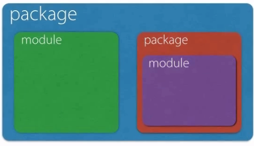
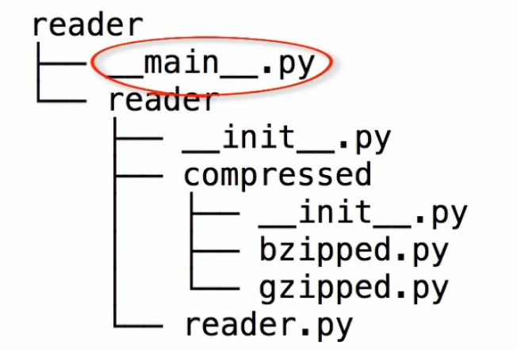
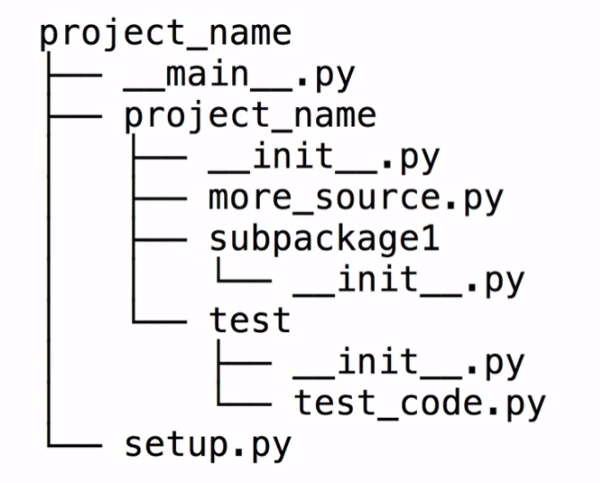
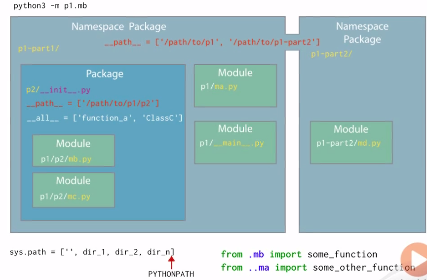

# Python-Note
this is my python study note :)

## the study of the plursight note


### Beyond the basic-Package:
1. **Module, package**, here is the general picture for the connection between package and module:

    

the **packages** are generally directories and the **Modules** are files (without any directories)
here is the type between urllib and urllib.request (the 1st is packages and 2nd is Modules):
```python
>>> import urllib>>> import urllib.request
>>> type (urllib)
<class 'module'>
>>> type (urllib.request)
<class 'module'>
>>> urllib.__path__
['C:\\Users\\jarffery\\AppData\\Local\\Programs\\Python\\Python37-32\\lib\\urllib']
>>> urllib.request.__path__
Traceback (most recent call last):
  File "<stdin>", line 1, in <module>
AttributeError: module 'urllib.request' has no attribute '__path__'
>>>
```

2. **How does Python locate modules?**

the Python would use the a Module named **sys.path** to list of directories Python searches for modules, using the sys.path to get the path of modules.
new path of module could be added in the **sys.path** using:
```python
sys.path.append('the name of the module')
import 'the name of the module'
```
3. **Basic package structure**

Here is the picture for a basic package structure:


  1. Packages are modules that contain other modules.
  2. Packages are generally implemented as directories containing a special "__init__.py" file.
  3. The "__init__.py" file is **excuted** when the package is imported.
  4. Packages can contain sub packages which themselves are implemented with "__init__.py" filesin directories.

### absolute imports & relative imports
**absolute imports**: usually it describe the way that import the module from the package with the full path.
**relative imports**: use a relative path to modules *in the same package*.

### the function of "__all__"
when trying to import the module in this way:
```python
from foo import *
```
the "__all__" is a string list that will include all the module thta can be import, otherwise there will be error message.(a list of attribute names imported via from module import *)

### Namespace packages (packages split across several directories)
this function is useful for splitting large packages into multiple parts, this was defined in the PEP420. **Namespace pakcages** have **no __init__.py**, which can avoids complex initialization ordering problems.
Python will scans all entries in sys.path to find the possible modules.

###executable directories
directories containing an entry point for Python execution, and the **__main__.py** in the folder can help the python to executate automatically.


### Summary of the package

Here is the picture of the project structure summary:


Here is the large project organizing:
