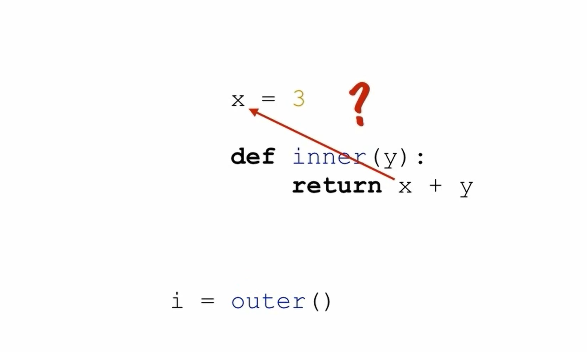

# local function
the local function will go with LEGB rules (local, enclosing, global, built-in)

for example:
```python
g = 'global'
def outer( p = 'param'):
    l = 'local'
    def inner():
        print(g, p, l)
    inner()

# try this
>>> outer()
global param local
# local function can not be called
>>> outer.inner()
Traceback (most recent call last):
  File "<stdin>", line 1, in <module>
AttributeError: 'function' object has no attribute 'inner'
```
## what are the local function use for?
1. useful for specialized, one-off functions
2. aid in code organization and readability
3. similar to lambdas, but more general

# returning functions from function

the local function can be returning using "return", for example:
```python
def enclosing():
    def local_func():
        print('local_func')
    return local_func

# try this:
>>> lf = enclosing()
>>> lf()
local_func 
# the lf was defined as the function local_func since the enclosing returned it
```
this is called first-class functions that can be treated like any other object

# Closures and nested scoope
how the local function can use the value out of the it?

the closures of the local function can remember the value that it used, and then keep them alive
```python
# the value was stored in the __closure__
def enclosing():
    x = 'closed over'
    def local_func():
        print(x)
    return local_func
#test the local function
>>> x = encllosing()
>>> x.__closure__ 
(<cell at 0x00E50D30: str object at 0x00E624F8>,)
```
Questions:
how this is really useful ???
## function factories

the closure can make sure the function can get the value from the factory function, here is the example:

```python
def raise_to(exp):
    def raise_to_exp(x):
        return pow(x, exp)
    return raise_to_exp
#test this function:
>>> squre = raise_to(2) 
>>> squre(5) 
25
>>> squre
<function raise_to.<locals>.raise_to_exp at 0x00E594F8>
>>> squre(9) 
81
```
see that is so amazon!!!!!
## the nonlocal keyword

