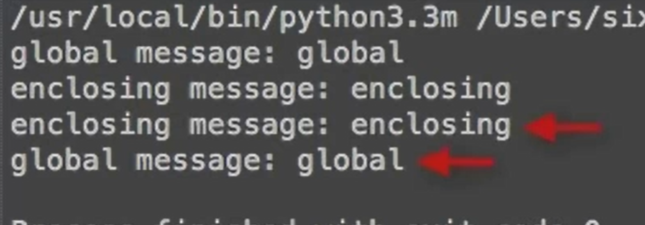
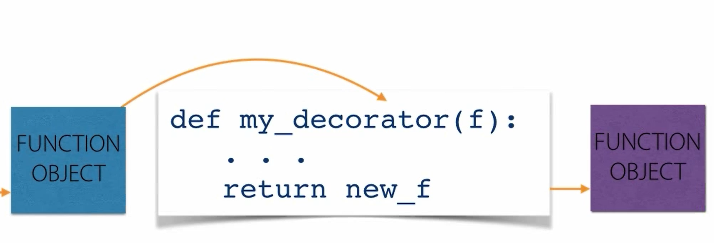

- [local function](#local-function)
  - [what are the local function use for?](#what-are-the-local-function-use-for)
- [returning functions from function](#returning-functions-from-function)
- [Closures and nested scoope](#closures-and-nested-scoope)
  - [function factories](#function-factories)
- [the nonlocal keyword](#the-nonlocal-keyword)
- [decorators](#decorators)
  - [the use of the decorators:](#the-use-of-the-decorators)
  - [multiple decorators](#multiple-decorators)
  - [problem when using the decorators](#problem-when-using-the-decorators)
  - [validating argument using the decorator to check](#validating-argument-using-the-decorator-to-check)
# local function
the local function will go with LEGB rules (local, enclosing, global, built-in)

for example:
```python
g = 'global'
def outer( p = 'param'):
    l = 'local'
    def inner():
        print(g, p, l)
    inner()

# try this
>>> outer()
global param local
# local function can not be called
>>> outer.inner()
Traceback (most recent call last):
  File "<stdin>", line 1, in <module>
AttributeError: 'function' object has no attribute 'inner'
```
## what are the local function use for?
1. useful for specialized, one-off functions
2. aid in code organization and readability
3. similar to lambdas, but more general

# returning functions from function

the local function can be returning using "return", for example:
```python
def enclosing():
    def local_func():
        print('local_func')
    return local_func

# try this:
>>> lf = enclosing()
>>> lf()
local_func 
# the lf was defined as the function local_func since the enclosing returned it
```
this is called first-class functions that can be treated like any other object

# Closures and nested scoope
how the local function can use the value out of the it?

the closures of the local function can remember the value that it used, and then keep them alive
```python
# the value was stored in the __closure__
def enclosing():
    x = 'closed over'
    def local_func():
        print(x)
    return local_func
#test the local function
>>> x = encllosing()
>>> x.__closure__ 
(<cell at 0x00E50D30: str object at 0x00E624F8>,)
```
Questions:
how this is really useful ???
## function factories

the closure can make sure the function can get the value from the factory function, here is the example:

```python
def raise_to(exp):
    def raise_to_exp(x):
        return pow(x, exp)
    return raise_to_exp
#test this function:
>>> squre = raise_to(2) 
>>> squre(5) 
25
>>> squre
<function raise_to.<locals>.raise_to_exp at 0x00E594F8>
>>> squre(9) 
81
```
see that is so amazon!!!!!
# the nonlocal keyword

the LEGB does not apply to the new name binding, for example:
```python
message = "global"
def enclosing():
    message = "enclosing"
    def local()"
        message = "local"
    print("enclosing message:", message)
    local()
    print("enclosing message:", message)

print("global message:", message)
# this step will bind the value local
enclosing() 
print("global message:", message)
```
here is the result, and the value in the local function can not replace the global and enclosing varity :(


* using the **global** can let the local function change the value.
* using the **nonlocal** can introduce names from the enclosing namespace into the local namespace
* if the name doesn't exist the SyntaxError will be raised

# decorators
1. modify or enhance functions without changing their definition
, the decorators **implemented as callables** that take and return other **callables**
2. the decorator was used the "@ in front of the function, for example:

```python
@my_decorator
def my_funciton():
...
```

## the use of the decorators:
here is an example of transfer letter into ASC2:
```python
def escape_unicode(f):
    def warp(*args, **kwargs):
        x = f(*args, **kwargs)
        return ascii(x)
    
    return warp

@escape_uniclde(f):
def china_city():
    return "中国“
```
the process of the decorators function:




#instances as decorators

the decorators used in the class


for instances:
```python
Class Trace:
    def __init__(self):
        self.enabled = True
    def __call__(self, f):
        def warp(*args, **kwargs):
            if self.enabled:
                print ('Calling {}'.format(f))
            return f(*args, **kwargs)
        return warp
#here is the instance deractors, before use the method in the class, the class need to be called first
tracer = Trace()
@tracer
def rotate_list(l):
    return l[1:] + [l[0]]
```
## multiple decorators
multiple decorators can be used and need to be list in the front of the function, for example:
```python
@decorator_1
@decorator_2
@decorator_3
def some_funciton():
    ...
```
the order of the decorator would be from **decorator_3** to **decorator_1**

**the decorator could also be used in class and method of class**

## problem when using the decorators
1. navie decorators can lose the important metadata.
2. the decorators will take over the **\_\_name\_\_** and **\_\_call\_\_** and lose the original value, the new assigned value is from the **decorators**. it is easy to be resolved:
```python
def noop(f):
    def noop_warpper():
        return f()
        noop_warpper.__name__ = f.__name__
        noop_warpper.__doc__ = f.__doc__
    return noop_warpper

@noop
def hello():
    "print a well-know message."
    print("Hello, world!")
```

but this is a ugly way to udpate the metadata, here a new method be introduced:
```python
#properly update metadata on wrapped funcitons, this is decorators that can help other decorators update the metadata
functools.wraps()
```
how to use it?
```python
import functools
def noop(f):
    @functools.warps(f)
    def noop_warpper():
        return f()
    return noop_warpper

@noop
def hello():
    "print a well-know message."
    print("Hello, world!")
```
## validating argument using the decorator to check
here is the example:
```python
def check_non_negative(index):
    def validator(f):
        def warp(*args):
            if args[index] < 0:
                raise ValueError(
                    'argument {} must be non-nagative.'.format(index)
                )
            return f(*args)
        return warp
    return validator

@check_non_negative(1)
def creat_list(value,size):
    return[value] * size

#let's test this function
>>> creat_list('a', 3)
['a', 'a', 'a']
>>> creat_list('a', -1)
Traceback (most recent call last):
  File "<stdin>", line 1, in <module>
  File "<stdin>", line 6, in warp
ValueError: argument 1 must be non-nagative. 
```

the decorator can be also be modified and take the argument as a extend function :D

