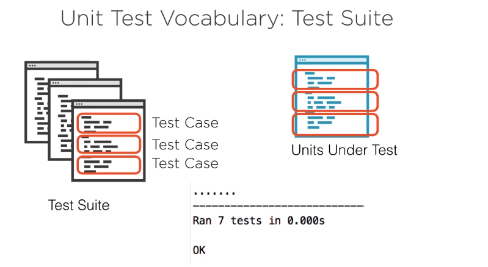
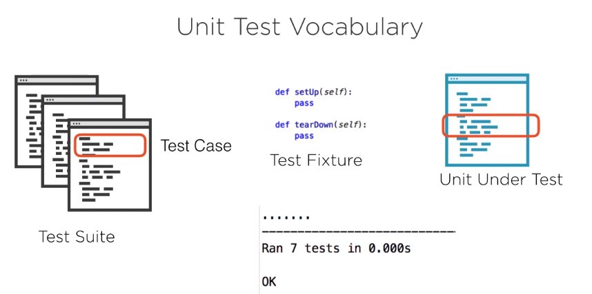

@@ -0, 0 + 1, 172 @@
Content

- [unit testing fundamental](  # unit-testing-fundamental)
    - [Unit Test Vocabulary](  # unit-test-vocabulary)
        - [Summary](  # summary)
            - [Unit Testing Why and When](  # unit-testing-why-and-when)
                - [understand what to build](  # understand-what-to-build)
                    - [document the unites](  # document-the-unites)
                        - [design the units](  # design-the-units)
                            - [regression protection](  # regression-protection)
                                - [Unit Testing with pytest](  # unit-testing-with-pytest)
                                    - [Testable Documentation with doctest](  # testable-documentation-with-doctest)
                                        - [Using Test Doubles](  # using-test-doubles)
                                            - [Parameterized Tests & Test Coverage](  # parameterized-tests--test-coverage)


                                                # unit testing fundamental

                                                it is a small Piece of code:
                                                * a method or funciton
                                                * a module or class
                                                * a small group of related classes

                                                automated unit test is designed by a human and run without intervention, reports either 'pass' or 'fail'.

                                              ```python
                                                import unittest


                                                class PhoneBook:

                                                def __init(self):
                                                self.numbers={}

                                                def add(self, name, number):
                                                self.numbers[name]=number
                                                pass

                                                def lookup(self, name):
                                                return self.numbers[name]

                                                def is_consistent(self):
                                                return True

                                                class PhoneBookTest(unittest.TestCase):

                                                def setUp(self) -> None:
                                                '''automatically run before unittest'''
                                                self.phonebook=PhoneBook()

                                                def tearDown(self) -> None:
                                                '''automatically run after unittest, release resources from memory like files'''
                                                pass

                                                def test_lookup_by_name(self):
                                                self.phonebook.add(
                                                    "Bob", "12345")
                                                number=self.phonebook.lookup(
                                                    "Bob")
                                                self.asertEqual(
                                                    "12345", number)

                                                def test_missing_name(self):
                                                with self.assertRaises(KeyError):
                                                self.phonebook.lookup(
                                                    "missing")

                                                # will sikp next module
                                                @unittest.skip("WIP")
                                                def test_empty_phonebook_is_consistent(self):
                                                self.assertTrue(
                                                    self.phonebook.is_consistent())
                                              ```

                                                if you want to run the unittest using: (in the same folder)

                                              ```bash
                                                python - m unittest
                                              ```

                                                Using pycharm and it can add the unittest in IDE.(try this: D).

                                                ## Unit Test Vocabulary
                                                * Test suite
                                                * Test case
                                                * Test Fixture
                                                * Unit Under Test(Test Runner)  

                                                the good structure of unitest is: (for each scenario)
                                                * arrange
                                                * act
                                                * assert

                                                Check the ** online document ** [Unittest](https: // docs.python.org/3/library/unittest.html)

                                                | Method | CHecks that | New in |
                                                |--- | --- | --- |
                                                |assertAlmostEqual(a, b) | round(a-b, 7) == 0 | |
                                                | assertNotAlmostEqual(a, b) | round(a-b, 7) != 0 | |
                                                | assertGreater(a, b) | a > b | 3.1 |
                                                |assertGreaterEqual(a, b) | a >= b | 3.1 |
                                                |assertLess(a, b) | a < b | 3.1 |
                                                |assertLessEqual(a, b) | a <= b | 3.1 |
                                                |assertRegex(s, r) | r.search(s) | 3.1 |
                                                |assertNotRegex(s, r) | not r.search(s) | 3.2 |
                                                |assertCountEqual(a, b) | a and b have the same elements in the same number, regardless of their order. | 3.2 |

                                                ## Summary

                                                vocabulary:
                                                * test case
                                                * teset runner
                                                * test Suite
                                                * test Fixture
                                                * test case Design:
                                                * Test name
                                                * arrange-Act-assert

                                                # Unit Testing Why and When

                                                what is Unit testing for?

                                                ## understand what to build

                                                * business Analysis
                                                * tester
                                                * Designer
                                                * architect
                                                * end-user
                                                * etc

                                                ## document the unites

                                                * specify behaviour of the unit under test
                                                * how the original developer indended the unit to be used.
                                                * excutable: keeps in sync with the unit under test  # design the units

                                              
                                                follow the logic stream(for a better design!)

                                                ## regression protection

                                                ensure previously developed and tested software still performs after a change

                                                uh...there is a lots of philosophy idea behind the regression protection

                                                # Unit Testing with pytest

                                                * Defining test cases with pytest
                                                * interpreting test failures
                                                * Test Fixtures
                                                * Organizing test code


                                                original unit testing like this: (not pythonic) 


                                                that bring us the pytest: a popular alternative to unittest

                                              [pytest link](https: // docs.pytest.org/en/latest/)

                                                the pytest could also added in the pycharm test Runner

                                                # Testable Documentation with doctest

                                                # Using Test Doubles

                                                # Parameterized Tests & Test Coverage
